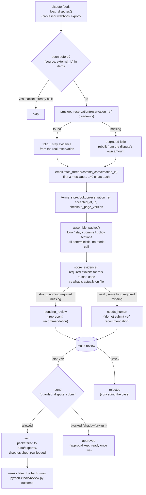

# Chargeback & Dispute AI — "The Defender"

Detects payment disputes/chargebacks, assembles the evidence packet
(booking, comms, policy, signatures), and drafts the response within the
deadline.

Clone this repo, open Claude Code inside it, and your own Claude session
sets it up and runs it. It knows nothing about the company that built this
template — everything it needs is in this folder.

## What it does

**Does.** Detects payment disputes/chargebacks, assembles the evidence
packet (booking, comms, policy, signatures), and drafts the response within
the deadline.

**Won't.** Won't submit without human review (financial/legal).

**Why.** Hotels lose winnable disputes purely by missing deadlines or weak
evidence.

**What to expect.** Lift dispute win-rate; recover a share of what's
currently written off.

**Roughly what it's worth.** +35% Dispute win-rate, in the source
material's own estimate. Treat that as directional, not a guarantee for
your property — see `docs/benefits.md` for how to measure your own numbers.

A note on the promise, up front, because this README will not repeat a
claim the code cannot back up: "detects" means reading whatever your
dispute feed hands over — a real payment-processor webhook is not built yet
(see "Connect your systems"). "Signatures" means the acceptance record your
`terms_store` actually has on file — a booking with no record on file gets
a packet that says so plainly instead of asserting one. And "drafts the
response" stops at a finished packet a human approves and files locally: no
card network is ever called — see "What it won't do" under Guardrails.

## Who it's for

A hotel, restaurant, or small hospitality group that takes deposits or card
payments and occasionally gets a chargeback — a deposit disputed after a
cancellation, a card-present charge someone says was not theirs. If
building the evidence file currently means someone hunting through the PMS
and an inbox under deadline pressure, or a dispute has ever been lost purely
because nobody submitted anything in time, this agent is for you.

It assumes:

- You can get dispute records into this agent — a payment processor's
  webhook is not built yet, so start with a CSV export from your
  processor's dashboard (`docs/integrations.md`).
- You have real reservation records and a real guest-comms archive to draw
  evidence from — the stronger those are, the stronger every packet is.
- Someone works the review queue and actually submits an approved packet to
  your processor's own portal — this agent never does that step for you.
- You are fine starting in `shadow` mode (compute and queue only) until you
  trust what it builds.

`venues: hotel, restaurant`. Everything below is written for a hotel; for a
restaurant the dominant case shifts from a deposit dispute to an event
no-show deposit (which maps almost exactly onto the same flow) or a
card-present "not my transaction" claim, which needs a different leading
exhibit — see "Customising", "The restaurant lens".

## How it works



**No model call builds the packet.** Every fact in an evidence packet comes
from your own systems, laid out by plain Python — the same design choice
the source material made: a document that has to stand up to a bank cannot
contain a sentence a model invented. See `docs/how-it-works.md` for the
full step-by-step and why that matters.

**Every dispute needs a human, always.** The roster's own promise is
explicit: "won't submit without human review." Unlike some other agents in
this family, there is no confidence level that lets a case skip the review
queue — a strong "represent" recommendation and a weak "do not submit yet"
one both wait in the same place. The verdict only changes what the
recommendation says, never whether a person has to approve and then send.

**Modes.** `mode: shadow` (default) computes and queues every packet but
never files one. `mode: live` lets an *approved* packet actually write a
file — see "Go live" below. Either way, this agent never calls a card
network; see "What it won't do".

**The review queue.** A packet lands as `pending_review` (represent) or
`needs_human` (do not submit yet) and waits. A person works the queue with
`make review` and `python3 tools/review.py` — approve, edit the
recommendation, reject, or send. See `workflows/80-review.md`.

**What runs when:**

| Step | Command | Suggested cadence | Talks to |
|---|---|---|---|
| Pull new disputes, build packets | `make run` | hourly | dispute feed, PMS, email, terms store |
| Human review, approve, file | `make review` | daily | — |
| Deadline digest (flags anything due soon) | `python3 tools/digest.py` | once a day | email adapter, messaging (staff alert) |
| Optional case-note (off by default) | `python3 tools/narrate.py` | with the digest | LLM provider |
| Benefit numbers, win rate | `make report` | weekly | — |

**Sub-agents in this repo:** none. No coach layer either — that promise
sits with Front Desk AI, Concierge AI, Upsell AI and CRM/Lead Nurture AI,
not here.

**What a "do not submit yet" packet's reason actually looks like.** A
dispute missing the guest correspondence, the set piece this repo checks
for on every reason code that needs it:

```
Do not submit yet (missing: comms). Gather the rest, or turn on the full
evidence pack, before EUR 300.00 goes to Visa on reason code 4853 with 10
day(s) left.
```

A clean case with every required exhibit on file, and nothing in the
guest's own words working against it, needs no such warning — it just reads
"represent in full."

## What you need

- **A dispute feed.** The `mock` adapter (no setup) reads the bundled
  sample cases. For a real property, a CSV export from your processor's
  dashboard — see "Connect your systems".
- **Reservation access, roughly.** A PMS integration or a CSV export so a
  packet can quote real dates, room type and stay total instead of just the
  dispute's own numbers.
- **A guest-comms archive, roughly.** Email is what this repo reads today;
  if your guest communication happens somewhere else, the recipe for
  connecting it is one method (`docs/integrations.md`).
- **Your cancellation policy, exactly as guests see it.** One file,
  `knowledge/cancellation-policy.md` — every packet quotes it verbatim.
- **Your own Claude Code subscription**, already open in this folder —
  enough for real volume on most properties, since the main loop makes no
  model calls at all. A metered API key is optional, only for the off-by-
  default case-manager note.
- **About 10 minutes** for the quick start below, and maybe half an hour to
  fill in your real policy, reason codes and evidence phrases.

## Quick start (5 minutes, no credentials)

```bash
git clone https://github.com/th1-ai/chargeback-dispute-ai.git chargeback-dispute-ai
cd chargeback-dispute-ai
make setup
make demo
```

`make setup` creates a virtual environment, installs the (tiny) dependency
list, and copies the example config files. `make demo` runs the whole loop
against five invented sample disputes — no credentials, no network. Expect
something close to this:

```
Chargeback & Dispute AI demo - 5 sample case(s) from fixtures/inbound/

  GM-20138: Marcus Webb EUR 940.00 -> verdict=represent strength=100/100 days_left=6 status=pending_review
  DP-3312: Priya Anand EUR 300.00 -> verdict=hold strength=75/100 days_left=10 status=needs_human
  DP-4470: Jonas Berg EUR 160.00 -> verdict=hold strength=70/100 days_left=2 status=needs_human
  DP-5501: Aiko Tanaka EUR 520.00 -> verdict=hold strength=67/100 days_left=8 status=needs_human
  DP-6100: Camille Duarte EUR 450.00 -> verdict=represent strength=100/100 days_left=12 status=pending_review

3 of 5 need a person to decide before submitting - see docs/safety.md. Every case needs a human either way: this agent never submits a representment on its own.
Nothing was filed: mode is shadow, and demo never calls finalize_dispute() at all.
Next: `make review ARGS="--demo"` to see these packets (this demo always runs on
its own sample data - your real config/agent.yaml applies to `make run`, not to
`make demo`). Once you connect your real systems: `make run` builds packets from
your own queue, then plain `make review` works that one.

DEMO OK — 5 items processed, 5 drafted, 0 sent (shadow)
```

That last line is the one to check: `DEMO OK` means every piece — the
fixtures, the reservations, the comms threads, the acceptance records, the
reason-code map — is wired up correctly on your machine. `make demo`
**always** runs this exact scenario from `config/hotel.example.yaml` and
`config/agent.example.yaml` — sample data only, deliberately isolated from
whatever you put in your own `config/hotel.yaml` / `config/agent.yaml`, so
a fresh clone shows the same five cases every time and a demo can never
read your real systems. Your own config applies to `make run` (below), not
to `make demo` - see `docs/how-it-works.md`, "Idempotency".

Look at what a weak case's packet actually says - `--demo` reads the
database `make demo` just wrote (`data/demo/demo.db`), not your own queue:

```bash
make review ARGS="--demo"
python3 tools/review.py show <id> --demo
```

To see one specific config value change real demo output, without
connecting anything yet: turn `rules.full_evidence_pack` off in
`config/agent.example.yaml` - the file `make demo` actually reads, never
`config/agent.yaml` - and run `make demo` again. Every packet now ships
without the comms and policy sections, and the warning names exactly what
is missing. Put the file back to `true` afterward; it is the shared
starting point every fresh clone copies from `make setup`. Once you fill in
`config/agent.yaml` for real (below), the same rule - and every other value
in it - changes what `make run` builds from your own queue.

Then `make doctor` — expect one `FAIL` (`hotel identity`, because the
property is still the shipped placeholder "Hotel Aurora") and a few `warn`
lines. That is the intended state of a fresh clone; see
`workflows/00-setup.md` for filling in the real property.

## Set up with Claude Code

Open `claude` in this folder. Work through these in order — each names the
workflow file Claude will actually follow, so you can read ahead if you want.

**Phase 1 — first run.**

> Read `workflows/00-setup.md` and walk me through it. I want the demo
> running first, then help me fill in my property details and my real
> cancellation policy.

**Phase 2 — connect your real systems.** Skip this while you are still
deciding.

> Read `docs/integrations.md`. I want to connect a real dispute feed, a
> real PMS or reservations export, and a real guest-comms mailbox — here's
> what I have: <describe your processor, PMS, and mailbox>. Run
> `make doctor` to check it.

**Phase 3 — run it and work the queue.**

> Read `workflows/10-dispute-packets.md` and `workflows/80-review.md`. Run
> the agent once, show me a strong case and a weak one, and walk me through
> approving, editing, rejecting, and filing a packet.

**Phase 4 — going live.**

> Read `workflows/90-go-live.md`. Go through the checklist honestly and
> tell me what is and is not ready. Explain plainly that even once live,
> every dispute still needs my approval before anything files, and this
> agent never submits anything to a bank on its own. Do not switch anything
> without me saying yes.

## Connect your systems

This agent uses four systems plus two small readers of its own. Full
status table and setup steps in `docs/integrations.md`; the short version:

| System | Adapter you'll actually use | Status | Needs |
|---|---|---|---|
| PMS (the reservation, read-only) | `mock` (demo) or `csv`/`cloudbeds`/`cli` | universal / built | Nothing, or a reservations export |
| Email (the comms thread, read-only) | `mock` (demo) or `imap`/`gmail` | universal / built | Nothing, or a mailbox |
| Messaging (the optional SLA staff alert) | `mock` (demo) or `unipile`/`webhook` | universal / built | Nothing, or a chat channel |
| Sheets (disputes log, report export) | `csv` or `google` | universal / built | Nothing, or a service account |
| Dispute feed | `mock` (demo) or `csv` | universal | Nothing, or a processor export |
| Terms store (the acceptance record) | `mock` (demo) or `csv` | universal | Nothing, or a booking-engine export |

**There is no `systems.payments.adapter`.** `core.adapters.get_stub("payments",
...)` is a deliberate stub — see "Guardrails & safety" and
`docs/how-it-works.md`, "Being honest about payments". This agent never
calls a card network at any point.

**"Detects" still needs a real feed connected.** As shipped, disputes come
from `config/agent.yaml: dispute_feed.adapter` — a live processor webhook
(Stripe's `charge.dispute.created`, Adyen's own notification) is a genuine
integration to add, not something this template can honestly claim already
works. `docs/integrations.md`, under "Implement your own", has the recipe.

Check what is actually working at any time:

```bash
make doctor
```

## Run it

```bash
make run                          # one pass over the dispute feed
make run ARGS="--limit 5"         # just the first five
make run ARGS="--dry-run"         # compute every packet, write nothing at all
make watch                        # loop on the configured interval
python3 tools/schedule.py --all   # cron / launchd / systemd snippets, one per job
python3 tools/digest.py           # build (and queue) today's dispute-queue digest
```

`config/agent.yaml: schedule` names each recurring job with its own command
(`dispute-packets`: hourly). `dispute-digest`'s cadence always comes from
`config/agent.yaml: digest.hour` (default 8, so `0 8 * * *`) — change the
time by changing `digest.hour`, not the `schedule:` block itself.
`python3 tools/schedule.py --all` prints a ready-to-paste snippet for each
job; `scheduler/` has cron, launchd (macOS) and systemd examples.

Work the queue with `make review` and `python3 tools/review.py` (list, show,
approve, edit, reject, retry, send, and — once your bank rules on a case —
`outcome`; see `workflows/80-review.md`).

**On cost:** the main loop makes zero model calls, so real spend here should
sit at or near zero unless you turn on the optional case-manager note
(`config/agent.yaml: narrate.enabled`) — see `docs/safety.md` for the
honest, subscription-vs-API breakdown, and `make report` for the running
total.

## Go live

Shadow (compute and queue only) is the default and the right place to stay
until you trust the packets. The full checklist is in
`workflows/90-go-live.md`; in short:

- [ ] `make doctor` is clean.
- [ ] `knowledge/cancellation-policy.md` has your real terms, verbatim —
      not the shipped example.
- [ ] Your real reason codes, evidence-strength threshold and SLA alert
      window are in `config/agent.yaml` — not the shipped examples, unless
      they genuinely match what you see.
- [ ] You have connected a real terms store and a real guest-comms archive —
      otherwise every packet honestly says no acceptance record or no
      correspondence is on file, which is safe but weaker than it needs to be.

Then, after clearing the shadow-era queue (`python3 tools/review.py stale`),
in `config/hotel.yaml`:

```yaml
mode: live
```

**What changes:** an *approved* dispute now really writes a packet file
(`data/exports/evidence-packets/<id>.md`) and a disputes-sheet row the
moment you run `python3 tools/review.py send`. **What does not change:**
every dispute still needs a human to approve it first — there is no
confidence level or evidence score that skips the queue — and this agent
never submits anything to a bank or processor; a person still opens the
processor's own dispute portal and files the packet by hand.

## Guardrails & safety

Full detail in `docs/safety.md`. The essentials:

- **Never submits a representment while `mode: shadow`, or without a
  human's approval, ever.** There is no autonomous path in this agent at
  all — every dispute, however strong its evidence, waits for `approve`
  then `send`.
- **Never calls a card network.** Filing a packet writes a local Markdown
  file and a sheet row; a human still submits it through the processor's
  own portal. Payment adapters are read-only stubs by design.
- **Never invents evidence.** No correspondence on file reads exactly that,
  not a paraphrase; no acceptance record reads exactly that, not an assumed
  "accepted electronically"; a missing reservation degrades the folio
  instead of guessing dates or a room type.
- **Never reads a hostile guest message as a strong case.** When the
  cardholder's own first message describes a service problem rather than a
  self-initiated cancellation, the recommendation is always "do not submit
  yet", whatever the rest of the paperwork looks like. And a guest message
  in a language `guest_language` has no phrases for is never read as
  neutral either — it holds for a person to read, with "no `<lang>` phrase
  set configured" as the reason.
- **`mode: shadow` blocks every write, approved or not.** Filing the packet
  and the sheet log are guarded exactly like any other write in this
  family.

**Telling people this was AI-assembled.** There is no guest-facing text
here — a packet is written for your bank or processor, never for the
cardholder, and the one message this agent sends (the digest) goes to your
own finance contact, not a third party. Full wording guidance in
`docs/safety.md`.

## Customising

**The one rule**, in `config/agent.yaml`, on by default:

| Rule | On | Off |
|---|---|---|
| `full_evidence_pack` | packets include the comms and policy sections when the reason code needs them | every packet ships without comms/policy, with a warning naming what is missing |

- **`reason_code_map`** — your real scheme reason-code prefixes → a human
  label and the exhibits that code actually needs (`folio`, `stay`,
  `comms`, `policy`). Add a code by adding a row; anything unmatched falls
  back to `default`, which requires everything.
- **`guest_language.<lang>.helps_case` / `.hurts_case`** — one entry per
  language code (`en`, `es`, ...), the phrases that mark a guest's own
  first message as a self-initiated cancellation, or as a service-failure
  claim that works against the case. A language with no entry is never
  scored — the case holds for a person to read, "no `<lang>` phrase set
  configured", instead of silently reading as neutral. Add an entry for
  every language you actually get disputes in.
- **`evidence_strength_threshold`** — below this score (0–100), the
  recommendation is "do not submit yet" even with every exhibit technically
  present but a hurting guest message; a human can still choose to approve
  and send anyway.
- **`sla.alert_days_before`** — how many days before the scheme deadline
  the daily digest calls a case urgent.
- **Adding a reason code.** Add a row to `reason_code_map`; nothing else
  needs to change.

**The restaurant lens.** For a restaurant rather than a hotel, the deposit
case (an event or large-party no-show) maps closely onto the same flow — no
changes needed. The other common restaurant case, a card-present "not my
transaction" claim, needs a different leading exhibit: the signed/PIN-
verified terminal slip, not the accepted terms. Add a `reason_code_map`
entry for that scheme's reason code with `requires: [folio, stay,
terminal_auth]`, and connect the terminal authorisation data from your POS
export — this repo does not model `terminal_auth` as a distinct evidence
type yet, so that field needs a small extension to `assemble_packet` in
`tools/engine.py` (ask your Claude session).

## Troubleshooting & FAQ

Full page: `workflows/99-troubleshooting.md`. Quick answers:

**"A dispute holds even though every exhibit looks present."** Check the
packet's own warnings — the guest's first message likely matches a phrase
in `config/agent.yaml: guest_language.<lang>.hurts_case`, or that language
has no `guest_language` entry at all yet ("no `<lang>` phrase set
configured"), or `knowledge/cancellation-policy.md` is still the shipped
example word for word.

**"No guest correspondence is attached to this booking" but I know there is
a thread.** Check `comms_conversation_id` on the dispute record matches the
thread's own id in your comms system exactly.

**"Can this submit the representment to Stripe/Adyen directly?"** Not by
design — see "What it won't do" above and `docs/how-it-works.md`, "Being
honest about payments". A human always submits the filed packet by hand.

**"`python3 tools/review.py send` says blocked."** Expected while
`mode: shadow` — see "Guardrails". Approve it anyway to record the
decision, then go live when ready.

**"How do I record what the bank actually decided?"** `python3
tools/review.py outcome <id> --result won|lost|won_in_part [--recovered
<amount>]`, once the item has been sent.

## Measuring the benefit

```bash
make report                       # win rate, amount recovered, spend
python3 tools/report.py --export   # also writes to your sheets adapter
```

The roster's promise is "+35% dispute win-rate; recover a share of what's
currently written off" — `docs/benefits.md` has the full breakdown of what
to track and the honest caveats (win rate reads `None`, not a guess, until
you have recorded real outcomes with `python3 tools/review.py outcome`).

## About

Built by [TH1](https://th1.ai) — AI agents for independent hotels. This
repo is MIT licensed (see `LICENSE`); take it, run it yourself, change
anything.

If you would rather have this set up and run for you, or want a real
processor-webhook integration built for your specific dispute feed, get in
touch through [th1.ai](https://th1.ai).

**Changelog.** This is the first published version of this template.
