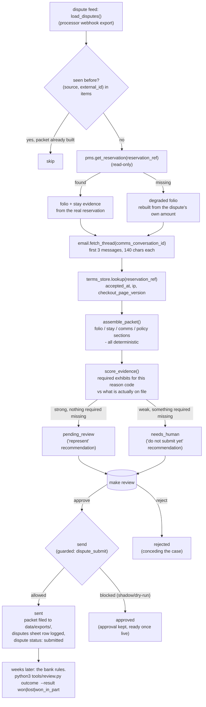

# How it works

Chargeback & Dispute AI ("The Defender") watches for payment disputes on
your bookings, pulls together the evidence your bank actually needs (the
booking record, the guest's own words, the terms they accepted, the deposit
charge), scores how strong the case is, and drafts the representment. A
person always reviews it and always presses submit — this repo never talks
to a card network.

## The central design choice: no model writes the packet

Everything that ends up in an evidence packet is plain Python over data you
already have: the reservation, the message thread, the acceptance record,
the reason-code rules in `config/agent.yaml`. There is **no LLM call
anywhere in the main loop** (`tools/run.py`). That is deliberate, and it is
the same choice the source material made: a document that has to stand up
to a bank cannot contain a sentence the model invented. See
`tools/engine.py` — every function in it is a pure function over dicts and
dataclasses, unit-tested directly.

The one model call in this repo is `narrate` — an optional, off-by-default,
cosmetic paragraph for the internal digest email (`tools/narrate.py`,
`tools/digest.py`). It never sees a packet's legal text, never changes a
score or a recommendation, and is read only after the fact. Turn it on with
`config/agent.yaml: narrate.enabled: true`.

## The loop

**Why every dispute needs a human, always.** The roster's own promise is
explicit: *"Won't submit without human review (financial/legal)."* Unlike
`finance-filing-ai` in this family, there is no confidence gate that lets a
case skip the queue — `needs_human` versus `pending_review` only changes
*what the recommendation says* (submit now, or don't yet), never whether a
person has to click "approve" and then "send". `core/review.py`'s guard
enforces this the same way it enforces everything else: `mode: shadow`
blocks the send outright, and in `mode: live` the action name
`dispute_submit` is on `review.require_approval_for` in
`config/hotel.example.yaml`, so an approval is still required either way.

## What runs when

| Step | Command | Suggested cadence | Talks to |
|---|---|---|---|
| Pull new disputes, build packets | `make run` (`workflows/10-dispute-packets.md`) | hourly | dispute feed, PMS, email, terms store |
| Human review, approve, send | `make review` (`workflows/80-review.md`) | daily | — |
| Deadline digest (flags anything due soon) | `python3 tools/digest.py` (`workflows/15-dispute-digest.md`) | once a day | email adapter (send), messaging (staff alert) |
| Optional case-note (off by default) | `python3 tools/narrate.py` | with the digest | LLM provider |
| Benefit numbers, win-rate | `make report` | weekly | — |

## Data model

One `items` row per dispute (`core/store.py`), `kind="dispute"`, `source`
is the dispute feed, `external_id` is the dispute reference (e.g.
`GM-20138`). No extra SQL tables — `store.migrate()` is not called, because
everything this agent needs fits the shared `items` shape.

- `payload` — the raw dispute record from `tools/dispute_feed.py`, refreshed
  on every pass. **Business state that must survive a refresh lives in
  `draft`, never in `payload`** — see the warning box below.
- `intent` — the recommendation verdict: `represent` or `hold`.
- `confidence` — the evidence-strength score (0–1), from `score_evidence()`.
- `draft` — the whole packet plus everything added after it is built:
  `{dispute_id, title, amount, currency, deadline_date, section_keys,
  sections, comms_excerpts, warnings, recommendation, score, ...}`. Once a
  human approves and sends, `finalize_dispute()` adds `submitted_at` and
  `filed_path`. Once the real bank ruling is in,
  `python3 tools/review.py outcome` adds `outcome` and `recovered_amount`.
- `review_status` — the shared FSM. `new → pending_review` (represent) or
  `new → needs_human` (hold), then `approved/edited → sending → sent` on
  approval, exactly like every other agent in this family.

**Why business state lives in `draft`, not `payload`.** `store.upsert_item()`
refreshes `payload` from the *new* record on every pass, keeping only keys
that start with `_` (see `core/store.py:upsert_item`, and
`tools/engine.py`'s own comment at the top of `process_dispute()`). A field
like `submitted_at` added straight to `payload` would be silently erased the
next time `tools/run.py` saw that dispute again. `draft` is never refreshed
by `upsert_item` — only `process_dispute()`, `finalize_dispute()` and
`record_outcome()` touch it — so it is the correct place for anything the
agent or a human adds after the packet is first built.

## Evidence sources

| Source | Reader | Status | What it provides |
|---|---|---|---|
| Payment processor / acquirer | `tools/dispute_feed.py` | universal (mock/csv) | the dispute itself: amount, reason code, scheme, deadline |
| PMS | `core.adapters.get_pms()` | universal/built (mock, csv, cloudbeds, cli) | the reservation: guest, dates, room, stay total, channel |
| Guest-comms archive | `core.adapters.get_email()`, `fetch_thread()` | universal/built (mock, imap, gmail) | the message thread, oldest first |
| Terms / acceptance record | `tools/terms_store.py` | universal (mock/csv) | when and how the cancellation terms were accepted |
| Cancellation policy text | `knowledge/cancellation-policy.md` | you write this | the terms themselves, verbatim, versioned |
| Sheets (disputes ledger, report export) | `core.adapters.get_sheets()` | universal/built (csv, google) | where a human sees the running list |
| Staff alert on a tight deadline | `core.adapters.get_messaging()` | universal/built (mock, unipile, webhook) | `notify_staff()` from the digest |
| Payment processor write-back | `core.adapters.get_stub("payments", ...)` | **stub, on purpose** | nothing — see "Being honest about payments" below |

### Being honest about payments

This repo never calls a card network. `core.adapters.get_stub("payments",
settings)` is the real, honest stub every agent in this family shares — its
`list_charges` and `refund` both raise `AdapterNotImplemented`, and nothing
here calls either. What this agent actually does with a dispute is: draft
the evidence, score it, let a person approve it, and — once approved and
`mode: live` — write the finished packet to
`data/exports/evidence-packets/<dispute-id>.md` and a row to your disputes
sheet. **A human still has to open their processor's dispute portal (Stripe,
Adyen, a bank's own form) and submit it themselves.** If your processor has
an API for submitting evidence and you want this repo to do that step too,
that is a real feature to add — see `docs/integrations.md#implement-your-own`
— and it should stay behind the same `dispute_submit` guard.

## Design decisions (the spec left these open)

`specs/chargeback-dispute-ai.md` §11 lists ten points the source demo left
unresolved or admits are inconsistent. Decisions taken here, and why:

1. **"Detects" is implemented as a feed reader, not a fabricated webhook.**
   The demo this was built from has no detection at all — disputes are
   seeded rows. `tools/dispute_feed.py` reads
   `fixtures/inbound/dispute-*.json` (mock) or `data/imports/disputes.csv`
   (csv, matched loosely like every other CSV reader in this family) — a
   real Stripe/Adyen `charge.dispute.created` webhook is a genuine
   integration to add (`docs/integrations.md#implement-your-own`), not
   something a template can honestly pretend already exists.
2. **"Signatures" now points at a real, if fixture-backed, record.**
   `tools/terms_store.py` reads `fixtures/hotel/terms-acceptance.json` (mock)
   or `data/imports/terms_acceptance.csv` (csv): `accepted_at`, `ip`,
   `checkout_page_version`, `policy_version`, keyed by reservation reference.
   When a reservation has no acceptance record, section 4 of the packet says
   so plainly instead of asserting the terms "were accepted electronically"
   with nothing behind that sentence — see `assemble_packet()`.
3. **The recommendation is scored, not a binary rule toggle.**
   `score_evidence()` checks, per reason code, which exhibits are actually
   on file (folio, stay, comms, policy+terms) against
   `config/agent.yaml: reason_code_map.<code>.requires`, and separately
   checks whether the guest's own first message *helps* (contains
   cancellation language) or *hurts* (contains a service-failure claim) the
   case. `recommend()` only returns "represent" when every required exhibit
   is present and the guest's words do not hurt the case — a packet with a
   hostile guest message no longer reads "strong" just because a rule is on.
   `guest_language` is keyed by language code (`guest_language.<lang>.helps_case`
   / `.hurts_case`); a language with no entry is never silently scored
   neutral — `assemble_packet()` detects the guest's own message language
   with `core.i18n.detect_language()` and, finding no phrase set for it,
   holds the case as `needs_human` ("no `<lang>` phrase set configured -
   review manually") instead.
4. **Reason codes drive which exhibits are required, via config, not a
   hard-coded sub-label.** `config/agent.yaml: reason_code_map` maps a
   handful of real reason-code prefixes (`4853`, `4855`, `10.4`, `13.1`) to
   a human label and the exhibits that code actually needs — a card-not-present
   fraud code (`10.4`) needs the terms-acceptance record more than the
   comms thread; a services-not-received code (`4853`) needs both. A reason
   code not in the table falls back to `reason_code_map.default`, which
   requires everything. `parse_reason_code()` still reads the free-text
   label off the dispute itself for display, so nothing is silently relabelled.
5. **The 3-message, 140-character excerpt cap is kept, but is no longer
   silently lossy.** The packet shows the same excerpt the source material
   did — it is genuinely enough to prove a cancellation in the guest's own
   words — but `assemble_packet()` also records `comms_thread_total`, the
   real message count, so a reviewer can see when there is more thread than
   what is quoted, and a human filing the real representment knows to pull
   the rest.
6. **The deadline is a real date, computed once, and the packet is
   deadline-aware.** `deadline_offset` from the feed is "how many days from
   the moment this agent first saw the dispute" — `process_dispute()` reads
   `deadline_offset` exactly once, at ingestion, and stores a fixed
   `deadline_date` in `draft` (never recomputed, so it cannot drift). Every
   later read computes `days_remaining()` fresh against today. `tools/digest.py`
   flags anything inside `config/agent.yaml: sla.alert_days_before` (default
   3) as urgent and can `notify_staff()`. This is the SLA-watch the spec
   points at (compare the source material's own Compliance/GDPR agent) —
   built here as a digest flag rather than a full tickler-task system, which
   is the natural next step if a property needs escalation beyond a daily
   email; see "Core requests" in the build report.
7. **Partial representment and a real recovered amount are both modelled.**
   `python3 tools/review.py outcome <id> --result won|lost|won_in_part
   --recovered <amount>` writes `outcome`, `recovered_amount` (which can be
   less than the disputed amount) and `decided_at` onto `draft`. `won_in_part`
   is a real, distinct value — the source material's `outcome` was a free
   string and `status` only ever reached `won`.
8. **The win-rate ROI has a real place to be measured now.**
   `make report` computes win rate, amount recovered versus amount disputed,
   and average days-to-submit from the `outcome` values above. Until a
   property has recorded real outcomes there is nothing to divide by zero on
   — the report says so plainly rather than showing a fake percentage.
9. **`lost` is reachable.** `python3 tools/review.py outcome --result lost`
   is the same command as `won` — the source demo's UI had no path to it at
   all; here it is one flag.
10. **The cancellation policy is a knowledge file, not a module constant.**
    `knowledge/cancellation-policy.md` holds the real text (see
    `knowledge/cancellation-policy.example.md`), loaded fresh on every
    packet — change the policy once, every future packet quotes the new
    version. `terms_store` records which `policy_version` a given guest
    actually accepted at booking time, so a packet always argues the terms
    that guest saw, not whatever is live today. A file that exists but is
    still a word-for-word copy of the example is caught two ways: `make
    doctor` compares content hashes (`tools/doctor.py:check_cancellation_policy`,
    the same approach as the hotel-identity check), and
    `assemble_packet()` refuses to represent — it forces `needs_human` and
    says so in the packet's warnings — while that is true, via
    `cancellation_policy_is_placeholder()`.

## Resumable stages

The main loop makes **zero** model calls, so the interactive-provider
"pends after an earlier stage succeeded" trap that other repos in this
family have to guard against (see `front-desk-ai`, `finance-filing-ai`)
does not apply to `process_dispute()` — there is nothing to resume, only
data to fetch and pure functions to run. The one place an LLM is ever
called, `tools/narrate.py`, is isolated exactly like `finance-filing-ai`'s
own optional note: it is never on the path `tools/run.py` walks, only
`tools/digest.py`, and `digest.py` catches `LLMPendingInteractive` and lets
it propagate (exit 3) rather than swallowing it — see
`core/llm.py:LLMPendingInteractive`'s own docstring for why that distinction
matters. A schema error or any other narrate failure is caught separately
and just means the digest goes out with no note.

## Idempotency

- `(source, external_id)` unique on `items` — a re-run of `make run` never
  rebuilds a packet that already exists (`item.draft is not None` is the
  resume check in `process_dispute()`).
- `store.claim_for_send()` atomically claims an approved dispute before
  `finalize_dispute()` runs, so two overlapping `python3 tools/review.py send`
  processes can never file the same packet twice.
- `make demo` runs on its own database (`data/demo/demo.db`), never touches
  `data/agent.db`, and always shows the same five bundled disputes.
- `--dry-run` computes and prints the whole packet and recommendation but
  never creates an `items` row, never writes a packet file, and never
  appends a sheet row — `assert_write_allowed` in `finalize_dispute()`
  raises before either write, and `process_dispute()` never calls
  `store.upsert_item()` at all when `settings.dry_run` is set.

## The restaurant lens

`venues` includes restaurant (`specs/chargeback-dispute-ai.md` §10). The
engine here is built around a deposit dispute, which maps closely onto an
event or large-party deposit for a no-show. The other common restaurant
case — "not my transaction" on a card-present bill — needs a different
leading exhibit (the signed/PIN-verified terminal slip, not the accepted
terms) that this repo does not model as a distinct evidence type yet. See
"Customising" in the README for the config change to add it: a
`reason_code_map` entry whose `requires` includes a new `terminal_auth`
exhibit, with the actual EMV/authorisation data read from your POS export.

## Sub-agents and the coach layer

None. This repo has no children in the roster
(`specs/chargeback-dispute-ai.md` §9), and the Email Optimizer / Coach AI
applies only to Front Desk AI, Concierge AI, Upsell AI and CRM / Lead
Nurture AI — not to a copilot-class finance agent like this one.
